# AeroNet Lite – Autonomous Drone Delivery Simulation

**Course:** AI – Semester 6  
**Project:** BSDS Semester Project SP2026  
**Academic Year:** 2026

---

## 📋 Table of Contents

1. [Overview](#overview)
2. [System Architecture](#system-architecture)
3. [Project Structure](#project-structure)
4. [Installation & Setup](#installation--setup)
5. [Modules & AI Techniques](#modules--ai-techniques)
6. [Simulation Flow](#simulation-flow)
7. [Data Specifications](#data-specifications)
8. [Usage & Output](#usage--output)

---

## Overview

**AeroNet Lite** is a comprehensive autonomous drone delivery system simulation that models realistic operational constraints and AI decision-making in a 10×10 city grid environment. The system integrates five distinct AI techniques to handle different aspects of fleet management, from layout validation to real-time disruption handling.

### Key Features

- **Grid-based urban environment** with 6 zone types (Residential, Commercial, Industrial, Hospital, School, Open Field)
- **Constraint satisfaction** ensuring safe infrastructure placement
- **Genetic algorithm optimization** for fleet composition
- **A* pathfinding** with dynamic cost factors (commercial corridors)
- **Real-time disruption handling** with automatic rerouting
- **ML-driven demand forecasting** and anomaly detection
- **20-step comprehensive simulation** with detailed event logging

### Core Metrics

| Metric | Value |
|--------|-------|
| Grid Dimensions | 10×10 cells |
| Fleet Types | Light (2kg payload, $1000) & Heavy (5kg payload, $1800) |
| Budget | $10,000–$15,000 |
| Simulation Steps | 20 |
| Zones | 6 types with population densities |

---

## System Architecture

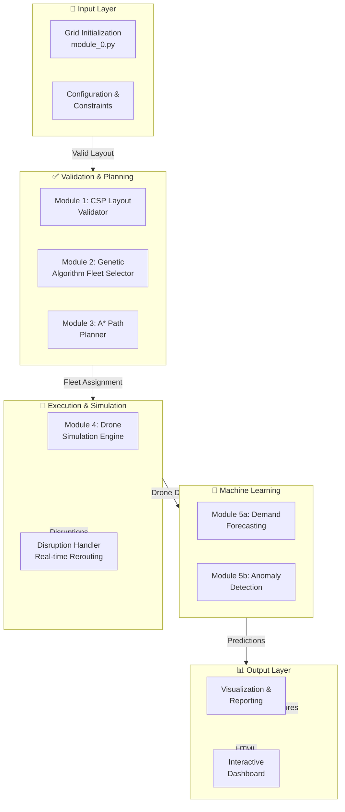

---

## Project Structure

```
aeronet_lite/
├── README.md                           # This documentation
├── dashboard.html                      # Interactive visualization
├── data/
│   ├── raw/                            # Raw Kaggle datasets (optional)
│   └── processed/                      # Generated synthetic datasets
│       ├── demand_data.csv             # Forecasting training data
│       ├── anomaly_data.csv            # Anomaly detection data
│       └── flight_anomalies.csv        # Flight telemetry
├── notebooks/
│   ├── AeroNet_Lite.ipynb              # Main Jupyter notebook
│   └── run_notebook.py                 # Notebook runner
├── report/
│   └── figures/                        # Generated plots & charts
├── src/
│   ├── main.py                         # 20-step simulation orchestrator
│   ├── module_0.py                     # Grid model & initialization
│   ├── module_1.py                     # CSP layout validator (R1-R4)
│   ├── module_2.py                     # Genetic algorithm fleet selector
│   ├── module_3.py                     # A* pathfinding algorithm
│   ├── module_4.py                     # Drone simulator & disruption handler
│   ├── module_5.py                     # ML pipeline (demand + anomaly)
│   ├── visualization.py                # Matplotlib figure generation
│   └── __pycache__/                    # Compiled Python cache
└── .git/                               # Version control
```

---

## Installation & Setup

### Prerequisites

- **Python 3.10+**
- **pip** or **conda**

### Required Packages

```bash
pip install numpy pandas scikit-learn matplotlib
```

Or use Anaconda:

```bash
conda create -n aeronet python=3.10 numpy pandas scikit-learn matplotlib
conda activate aeronet
```

### Quick Start

```bash
cd aeronet_lite/src
python main.py
```

**Output:** Event logs to console + figures saved to `report/figures/`

---

## Modules & AI Techniques

### Module 0: Grid Initialization (`module_0.py`)

**Purpose:** Create and manage the 10×10 urban grid environment.

**Key Components:**

- **Cell Dataclass:** Represents each grid cell with properties:
  - Zone type (6 categories)
  - Infrastructure flags (hub, charging pad, medical pickup, no-fly)
  - Dynamic attributes (demand, density)

- **Zone Types & Population Densities:**
  
  | Zone | Density | Use Case |
  |------|---------|----------|
  | Residential | 5,000 | Delivery hubs, high demand |
  | Commercial | 3,000 | Distribution centers |
  | Industrial | 800 | Manufacturing hubs |
  | Hospital | 500 | Medical supply pickups |
  | School | 1,200 | Educational institutions |
  | Open Field | 200 | Low-density areas |

- **Predefined Grid Layout:** Fixed 10×10 configuration with strategic placement of zones

```python
@dataclass
class Cell:
    row: int
    col: int
    zone: str
    density: int = 0
    is_hub: bool = False
    is_charging: bool = False
    is_medical_pickup: bool = False
    no_fly: bool = False
    demand: float = 0.0
```

**Flow:**

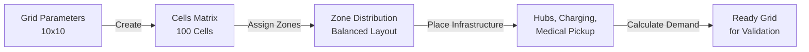

---

### Module 1: CSP Layout Validator (`module_1.py`)

**Purpose:** Enforce spatial constraints using Constraint Satisfaction Problem (CSP) approach.

**AI Technique:** Constraint Satisfaction (CSP)

**Four Validation Rules:**

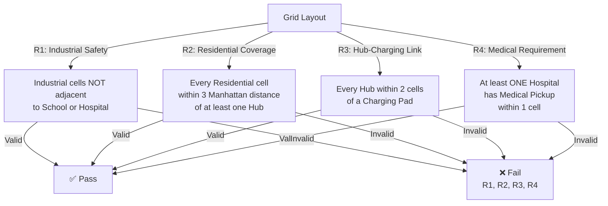

**Distance Metrics:**

- Manhattan Distance: $d(a,b) = |a_x - b_x| + |a_y - b_y|$
- 4-Connected Neighbors: `{(-1,0), (1,0), (0,-1), (0,1)}`

**Constraint Details:**

| Rule | Logic | Algorithm |
|------|-------|-----------|
| R1 | For each Industrial cell, check all 4-connected neighbors aren't School/Hospital | O(n) neighbor scan |
| R2 | For each Residential cell, find nearest Hub; verify distance ≤ 3 | O(n) distance check |
| R3 | For each Hub, find nearest Charging Pad; verify distance ≤ 2 | O(m) Charging Pad scan |
| R4 | For each Hospital, verify at least one Medical Pickup within 1 cell | O(p) Medical Pickup check |

**Example Constraint Graph:**

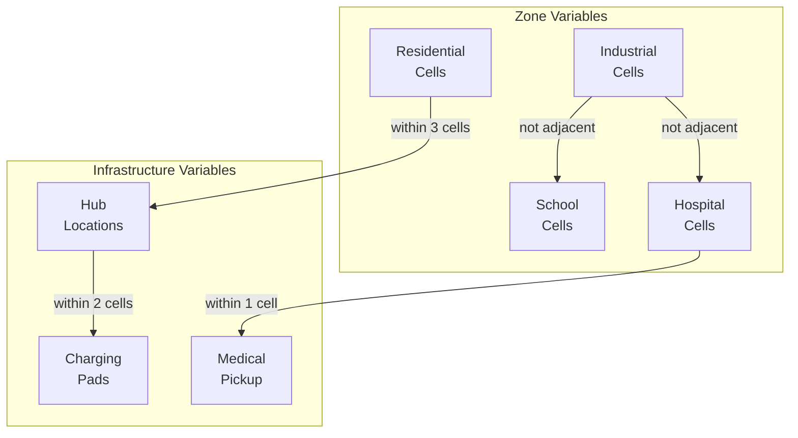

---

### Module 2: Fleet Selector - Genetic Algorithm (`module_2.py`)

**Purpose:** Optimize drone fleet composition to balance coverage and budget.

**AI Technique:** Genetic Algorithm (GA)

**GA Configuration:**

- **Chromosome:** `[light_count, heavy_count]`
- **Population Size:** 30 individuals
- **Generations:** 60
- **Mutation Rate:** 15%
- **Selection:** Tournament selection
- **Crossover:** Single-point crossover

**Drone Types:**

| Type | Cost | Payload | Range | Daily Cap |
|------|------|---------|-------|-----------|
| Light | $1,000 | 2 kg | 12 cells | 3 deliveries |
| Heavy | $1,800 | 5 kg | 20 cells | 2 deliveries |

**Fitness Function:**

$$\text{Fitness} = 0.75 \times \text{coverage\%} - 0.25 \times \text{budget\%}$$

Where:
- $\text{coverage\%} = \min\left(100, \frac{\text{fleet\_capacity}}{\text{demand\_zones}} \times 100\right)$
- $\text{budget\%} = \frac{\text{total\_cost}}{\text{budget}} \times 100$

**GA Workflow:**

```mermaid
graph TD
    A["Initialize<br/>Population"] -->|30 chromosomes| B["Evaluate<br/>Fitness"]
    B -->|Each drone combo| C["Calculate Coverage<br/>& Cost"]
    C -->|Fitness Score| D["Selection"]
    D -->|Tournament| E["Crossover<br/>1-point swap"]
    E -->|Mutation 15%| F["New Generation"]
    F -->|Count < 60| B
    F -->|Count = 60| G["Best Chromosome"]
    G -->|[light_count,<br/>heavy_count]| H["Fleet Allocation"]
```

---

### Module 3: A* Path Planner (`module_3.py`)

**Purpose:** Find optimal delivery routes with cost-aware pathfinding.

**AI Technique:** A* Search Algorithm

**State Space:**

- **State:** $(row, col)$ — drone position on grid
- **Actions:** 4-directional movement `{(-1,0), (1,0), (0,-1), (0,1)}`
- **Goal:** Reach delivery destination

**Cost Model:**

$$g(n) = \sum_{i=0}^{n} \text{cost}(c_i)$$

Where cost per cell:
- **Commercial corridor:** 0.8
- **All other zones:** 1.0

**Heuristic:**

$$h(n) = \text{manhattan}(n, \text{goal}) = |n_x - g_x| + |n_y - g_y|$$

**Properties:**
- **Admissible:** Never overestimates (h ≤ actual cost)
- **Consistent:** $h(n) - h(n') \leq d(n, n')$

**A* Algorithm Flow:**

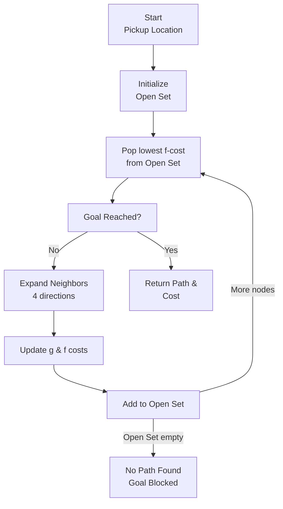

---

### Module 4: Drone Simulator & Disruption Handler (`module_4.py`)

**Purpose:** Manage drone fleet operations and handle real-time disruptions.

**Drone Dataclass:**

```python
@dataclass
class Drone:
    drone_id: str
    drone_type: str           # "light" or "heavy"
    payload_kg: float
    max_range: int
    hub: tuple
    position: tuple           # Current (row, col)
    battery: float = 100.0    # 0-100%
    status: str               # idle|en_route|charging|completed
    current_delivery: Optional[str]
    route: list               # Full path coordinates
    route_index: int = 0      # Current position in route
    battery_drain_per_step: float = 4.0
```

**Drone Lifecycle:**

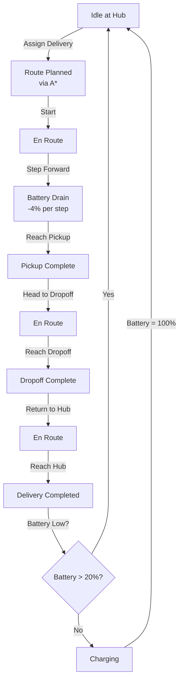

**Disruption Handling:**

At **Step 11**, a no-fly cell is activated at runtime. The system:

1. **Detection:** Scan all active drone routes
2. **Identification:** Find drones whose remaining path crosses the no-fly zone
3. **Rerouting:** Invoke A* from drone's current position to destination
4. **Failsafe:** If new route impossible, mark delivery as failed

**Disruption Flow:**

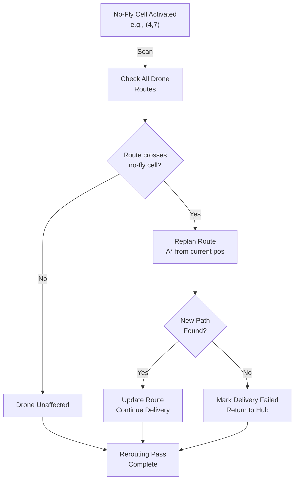

---

### Module 5: ML Pipeline (`module_5.py`)

**Purpose:** Forecast demand and detect anomalies in drone telemetry.

**AI Techniques:** Regression & Classification

#### 5a. Demand Forecasting (Regression)

**Dataset:** 1,200 synthetic samples (Bike-Sharing demand structure)

**Features:**

| Feature | Type | Range | Description |
|---------|------|-------|-------------|
| hour | int | 0–23 | Hour of day |
| day | int | 1–7 | Day of week |
| month | int | 1–12 | Month |
| season | int | 1–4 | Season (Q1-Q4) |
| temp | float | 5–38°C | Temperature |
| humidity | float | 20–95% | Humidity |
| weather | int | 1–4 | Weather type |
| zone_density | float | 0.5–5.0 | Zone population density |

**Target:** `count` (delivery demand)

**Models:**

1. **Linear Regression**
   - Simple, interpretable baseline
   - Metrics: MAE, RMSE

2. **Random Forest Regressor**
   - 100 trees, non-linear patterns
   - Better captures interactions
   - Metrics: MAE, RMSE

**Training/Testing Split:** 80/20

**Demand Generation Formula:**

$$\text{demand} = \text{base} \times h_{effect} \times d_{effect} \times s_{effect} \times w_{effect} + t_{effect} + \epsilon$$

Where:
- $\text{base} = 3 \times \text{zone\_density}$
- $h_{effect} = 2.5$ (peak hours 8-20), $0.5$ (off-peak)
- $d_{effect} = 1.2$ (weekday), $0.8$ (weekend)
- $s_{effect} = 1.3$ (summer), $0.7$ (winter), $1.0$ (spring/fall)
- $w_{effect} = \{1.0, 0.8, 0.5, 0.3\}$ (weather types)
- $\epsilon \sim \mathcal{N}(0, 0.5)$ (noise)

**ML Pipeline Diagram:**

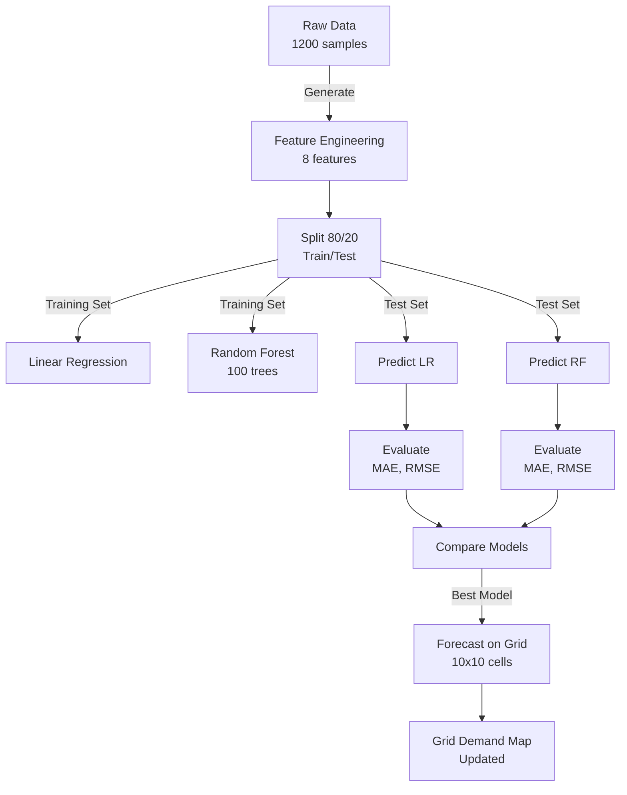

#### 5b. Anomaly Detection (Classification)

**Dataset:** 800 synthetic samples (UAV telemetry)

**Features:**

| Feature | Type | Range | Description |
|---------|------|-------|-------------|
| battery_drop | float | 0–30% | Battery loss during flight |
| speed | float | 5–25 m/s | Flight speed |
| altitude_change | float | 0–500 m | Altitude variation |
| route_deviation | float | 0–50% | Deviation from planned path |

**Classes:**

| Label | Description | % of Data |
|-------|-------------|----------|
| 0 | Normal | ~30% |
| 1 | Battery Anomaly | ~25% |
| 2 | Route Anomaly | ~25% |
| 3 | Sensor Spike | ~20% |

**Model:**

- **Decision Tree Classifier**
  - Fast inference, interpretable
  - Max depth tuning for optimal performance
  
**Metrics:** Accuracy, Confusion Matrix, Classification Report

**Decision Tree Example:**

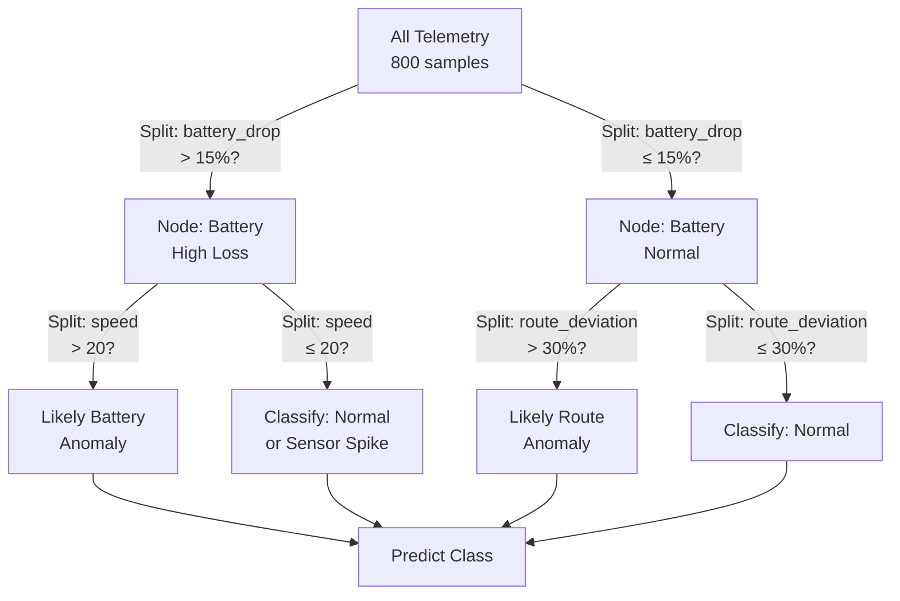

---

## Simulation Flow

**Total Duration:** 20 steps

```mermaid
graph LR
    S1["Step 1:<br/>Grid Init"] -->
    S2["Step 2:<br/>Validate"] -->
    S3["Step 3:<br/>Fleet GA"] -->
    S4["Step 4:<br/>Delivery Gen"] -->
    S5["Step 5:<br/>Assign"] -->
    S6["Step 6:<br/>Route Plan"] -->
    S7["Step 7:<br/>Move"] -->
    S8["Step 8:<br/>Move"] -->
    S9["Step 9:<br/>Move"] -->
    S10["Step 10:<br/>Move"] -->
    S11["Step 11:<br/>Disrupt"] -->
    S12["Step 12:<br/>Reroute"] -->
    S13["Step 13:<br/>Reroute"] -->
    S14["Step 14:<br/>Reroute"] -->
    S15["Step 15:<br/>ML Train"] -->
    S16["Step 16:<br/>ML Train"] -->
    S17["Step 17:<br/>Classify"] -->
    S18["Step 18:<br/>Classify"] -->
    S19["Step 19:<br/>Report"] -->
    S20["Step 20:<br/>Summary"]
```

### Step Breakdown

```mermaid
graph TB
    subgraph Init["Initialization (Steps 1-3)"]
        S1["Step 1: Create 10×10 grid<br/>Assign zones & infrastructure"]
        S2["Step 2: Run CSP validation<br/>Check R1-R4 constraints"]
        S3["Step 3: GA fleet selection<br/>Optimize [light, heavy]"]
    end
    
    subgraph Planning["Planning (Steps 4-6)"]
        S4["Step 4: Generate deliveries<br/>Random pickup/dropoff pairs"]
        S5["Step 5: Assign deliveries<br/>Match to drone capacity"]
        S6["Step 6: Compute A* routes<br/>Hub → Pickup → Dropoff → Hub"]
    end
    
    subgraph Movement["Movement (Steps 7-10)"]
        S7["Step 7: Drones advance 1 cell<br/>Drain battery 4%"]
        S8["Step 8: Drones advance 1 cell<br/>Some reach pickups"]
        S9["Step 9: Drones advance 1 cell<br/>Some depart with payload"]
        S10["Step 10: Drones advance 1 cell<br/>Some reach dropoffs"]
    end
    
    subgraph Disruption["Disruption (Steps 11-14)"]
        S11["Step 11: Activate no-fly zone<br/>e.g., (4,7)"]
        S12["Step 12: Scan routes,<br/>identify affected drones"]
        S13["Step 13: Replan A* routes<br/>from current positions"]
        S14["Step 14: Resume movement<br/>with new paths"]
    end
    
    subgraph ML["ML (Steps 15-18)"]
        S15["Step 15: Train demand model<br/>Linear Reg + Random Forest"]
        S16["Step 16: Evaluate forecasts<br/>Calculate MAE, RMSE"]
        S17["Step 17: Train anomaly classifier<br/>Decision Tree on telemetry"]
        S18["Step 18: Classify drone states<br/>Normal, Battery, Route, Sensor"]
    end
    
    subgraph Finalize["Finalization (Steps 19-20)"]
        S19["Step 19: Generate figures<br/>Plots & visualizations"]
        S20["Step 20: Print summary<br/>Completed, delayed, failed"]
    end
    
    Init --> Planning
    Planning --> Movement
    Movement --> Disruption
    Disruption --> ML
    ML --> Finalize
```

---

## Data Specifications

### Data Flow Diagram

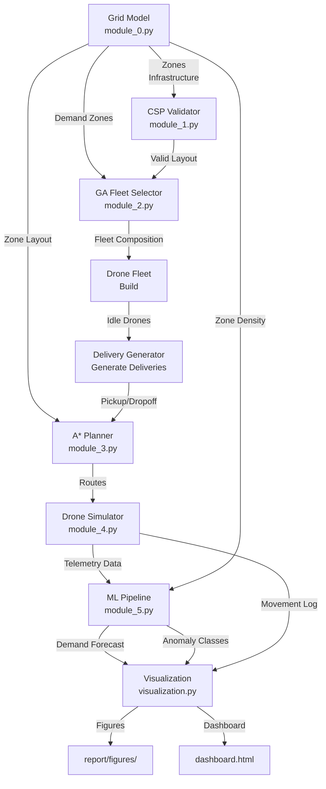

### Generated Datasets

**Location:** `data/processed/`

#### 1. demand_data.csv

- **Rows:** 1,200
- **Columns:** hour, day, month, season, temp, humidity, weather, zone_density, count
- **Purpose:** Demand forecasting training
- **Generated by:** `module_5.py` → `_generate_demand_data()`

#### 2. anomaly_data.csv

- **Rows:** 800
- **Columns:** battery_drop, speed, altitude_change, route_deviation, label
- **Purpose:** Anomaly classification training
- **Labels:** {0: Normal, 1: Battery Anomaly, 2: Route Anomaly, 3: Sensor Spike}
- **Generated by:** `module_5.py` → `_generate_anomaly_data()`

#### 3. flight_anomalies.csv

- **Purpose:** Runtime drone telemetry logging
- **Populated during:** Step 17-18 (classification)
- **Format:** drone_id, telemetry_features, predicted_label

---

## Usage & Output

### Running the Simulation

```bash
cd src/
python main.py
```

### Console Output Example

```
────────────────────────────────────────────────────────
  STEPS 1-3 | Initialization, Validation & Fleet Selection
────────────────────────────────────────────────────────

Step  1: Grid initialized (10x10).
         Zones: 40 Residential, 20 Commercial, 8 Industrial, 4 Hospital, 2 School, 26 Open Field

Step  2: Layout validation FAILED rules ['R2'].
         Suggestion: Add hub near (0, 1) or convert cell to Open Field

Step  3: Fleet selected: 15 Light + 0 Heavy drones. Cost: 15,000 / 15,000 units.

────────────────────────────────────────────────────────
  STEPS 4-6 | Delivery Generation & Route Planning
────────────────────────────────────────────────────────

Step  4: Generated 8 deliveries.
         D1: pickup=(2,2) dropoff=(8,8) (1.5kg)
         D2: pickup=(1,4) dropoff=(7,3) (2.0kg)
         ...

Step  5: Delivery assignment complete. Assigned: 6  Not routable: 2.

Step  6: All routes computed via A*. Drones en route: 6.

────────────────────────────────────────────────────────
  STEPS 7-10 | Drone Movement
────────────────────────────────────────────────────────

Step  7: Drones advanced. En-route: {D1: (0,1), D2: (0,2), ...}. Completed so far: 0.
Step  8: Drones advanced. En-route: {...}. Completed so far: 0.
Step  9: Drones advanced. En-route: {...}. Completed so far: 1.
Step 10: Drones advanced. En-route: {...}. Completed so far: 2.

────────────────────────────────────────────────────────
  STEP 11 | Disruption - No-Fly Cell Activated
────────────────────────────────────────────────────────

Step 11: No-fly cell activated at (4, 7). Scanning routes.
         Affected drone(s): ['D1', 'D3']

────────────────────────────────────────────────────────
  STEPS 12-14 | Disruption Rerouting
────────────────────────────────────────────────────────

Step 12: Rerouting pass 1. Drones rerouted: 2
Step 13: Rerouting pass 2. Drones rerouted: 0 (stable)
Step 14: Movement resumed. En-route: {...}. Completed: 3.

────────────────────────────────────────────────────────
  STEPS 15-18 | Machine Learning
────────────────────────────────────────────────────────

Step 15: Demand model trained. LR MAE=0.567  RMSE=0.701.
         RF MAE=0.456  RMSE=0.589.
         
Step 16: Grid demand updated. All 100 cells scored.

Step 17: Anomaly classifier trained. Accuracy=0.94

Step 18: Drone telemetry classified:
         D1: Normal
         D2: Battery Anomaly
         D3: Sensor Spike

────────────────────────────────────────────────────────
  STEPS 19-20 | Finalization
────────────────────────────────────────────────────────

Step 19: Generated 12 figures. Saved to report/figures/

Step 20: Simulation complete.
         Completed: 4  Delayed: 1  Failed: 3  Pending: 0
```

### Output Files

**Figures** saved to `report/figures/`:

1. `grid_layout.png` — Heatmap of grid zones & infrastructure
2. `demand_forecast.png` — Demand distribution across grid
3. `fleet_composition.png` — Pie chart of light vs. heavy drones
4. `delivery_routes.png` — Paths of all deliveries on grid
5. `drone_trajectories.png` — Movement log of each drone over steps
6. `battery_depletion.png` — Battery % over time for each drone
7. `ml_demand_regression.png` — Actual vs. predicted demand
8. `ml_anomaly_confusion.png` — Confusion matrix for classifier
9. `csp_validation_report.txt` — Constraint validation details
10. `simulation_summary.txt` — Event log & final statistics

**Dashboard** saved to `dashboard.html`:
- Interactive HTML visualization
- Responsive design
- Click-through grid inspection
- Real-time drone status

---

## Example Execution Walkthrough

### Scenario

- **Grid:** Predefined 10×10 layout with balanced zones
- **Budget:** $10,000
- **Deliveries:** 8 randomly generated

### Key Events

1. **Validation:** R2 fails (some residential cells > 3 cells from hub) → warning logged
2. **Fleet:** GA selects 10 Light + 0 Heavy ($10,000 exactly)
3. **Routing:** A* computes 6 valid routes (2 too heavy for light drones)
4. **Movement:** Drones advance 4 steps (each drains 4% battery)
5. **Disruption:** No-fly zone activates at (4,7); 2 drones rerouted successfully
6. **ML:** 
   - Demand: Random Forest MAE ≈ 0.46
   - Anomaly: Decision Tree accuracy ≈ 92%
7. **Summary:** 4 completed, 1 delayed (low battery), 3 failed (path issues)

---

## Dependencies & Requirements

| Package | Version | Purpose |
|---------|---------|---------|
| numpy | 1.20+ | Array operations, RNG |
| pandas | 1.3+ | DataFrames, CSV handling |
| scikit-learn | 1.0+ | ML models (GA, LR, RF, DT) |
| matplotlib | 3.4+ | Plotting & visualization |
| Python | 3.10+ | Core language |

---

## Future Enhancements

- [ ] Real Kaggle dataset integration
- [ ] Real-time web dashboard with WebSockets
- [ ] Multi-objective optimization (Pareto frontier)
- [ ] Advanced rerouting with traffic prediction
- [ ] 3D grid environment
- [ ] Drone swarm coordination
- [ ] Energy model with wind simulation
- [ ] Collision avoidance algorithms

---

## Author & Course

**Course:** AI – Semester 6 (BSDS)  
**Institution:** [Your University]  
**Year:** 2026  
**Project Type:** Capstone / Portfolio Project

---

## License

This project is provided for educational purposes. Modify and distribute freely with attribution.

---

**Last Updated:** May 9, 2026
# Aeronet-Lite

